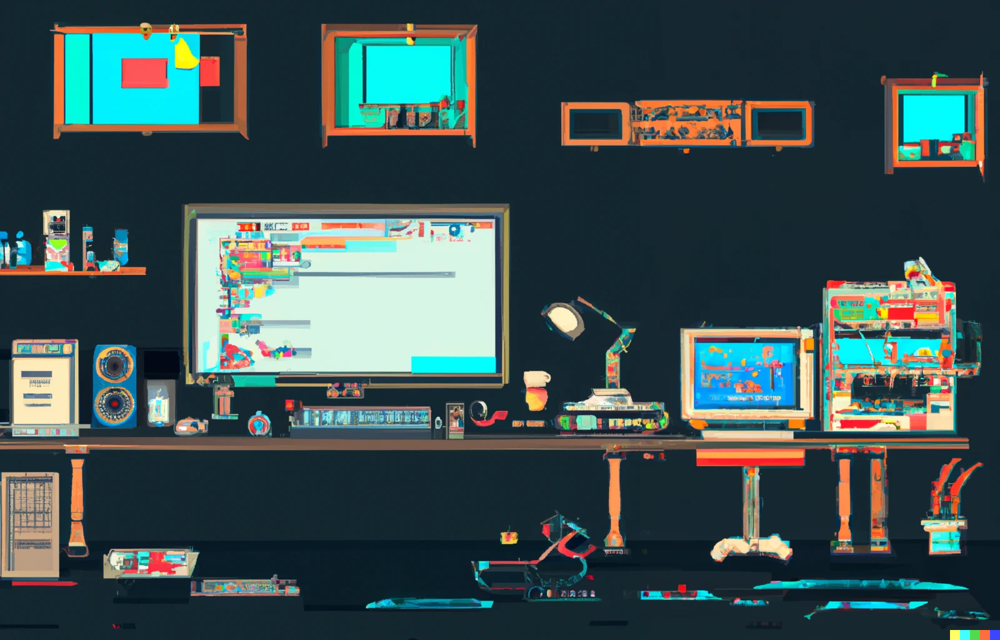

    <h1> Hello there 👋</h1>
    

---

### :computer: About Me

I am a Full Stack Developer from Germany

- 🔭 I am working on UI5 Web Applications, as well as the communication to the corresponding SAP Backend System. Because that's not enough I am also working on SAP Software for the Energy Sector.
- 🌱 I’m currently learning the ropes of the SAP PM Module.
- 📫 How to reach me: I'm looking into my linked eMail every few weeks or so.
- :zap: Fun Fact: I am using the Arch Penguin. 

---

### :hammer_and_wrench: Languages and Tools

    &nbsp;
    &nbsp;
    &nbsp;
    &nbsp;
    &nbsp;
    &nbsp;
    &nbsp;
    &nbsp;
    &nbsp;
    

---

### Additional Information

